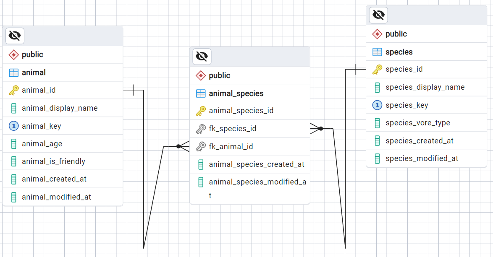

# PostgreSQL (part 1)

## Introduction

Goal: Learn how to create CRUD (Create, Read, Update, Delete) operations for a `postgreSQL` database.

How: Use `python` scripting with `FastAPI` to provide API endpoints through which CRUD commands may be completed. 

This tutorial builds from the knowledge gained through learning about `FastAPI`. If you have not already completed the [FastAPI tutorial](../../fastapi/docs/01_FastAPI.md), please follow this tutorial first. 

## Download and Install PostgreSQL

If PostgreSQL is installed already, it may be found on Windows in:

```
C:\Program Files\PostgreSQL
```

If it's not already installed, you can download the [PostgreSQL installer](https://www.postgresql.org/download/)

To launch a terminal window through which you can interact with `postgresql` you can execute the `runpsql.bat` file that may be found in this directory:

```
C:\Program Files\PostgreSQL\{VERSION_NUMBER}\scripts\
```

Executing your `runpsql.bat` file will open up a terminal. Enter your connection information:

Connect:
``` shell
Server [localhost]:
Database [postgres]:
Port [5432]:
Username [postgres]:
Password for user postgres:
```

Use the following commands to interact with `postgresql`:

``` shell
# list available databases
\l

# create a database named "foo"
CREATE DATABASE foo;

# drop a database named "foo"
DROP DATABASE foo;
```

An alternative way to connect to `postgresql` through powershell is the following:

``` shell
# create or open an existing profile for powershell
notepad $PROFILE

# This should open a text file. Paste your alias into the profile text file (adjust the path to match your local psql.exe path):
Set-Alias psql "C:\Program Files\PostgreSQL\16\bin\psql.exe"

# close the powershell, reopen and verify the alias is working
 psql --version
```

If you are using `psql` as an alias in powershell, you can login to `postgresql` datbase with:

``` shell
psql --host=localhost --port=5432 --username={username}

# If you define a Windows Environment variable clled "DB_POSTGRESQL_USER" you can use it like this:
psql --host=localhost --port=5432 --username=$env:DB_POSTGRESQL_USER
```

PostgreSQL uses an environment for the password which can be set in powershell, referencing an environment variable (for security) in order to log in without having to manually enter the password:

``` shell
$env:PGPASSWORD = $env:YOUR_PWD_ENVIRONMENT_VARIABLE;
psql --host=localhost --port=5432 --username=$env:DB_POSTGRESQL_USER
$env:PGPASSWORD = "";
```

## PostgreSQL Credentials

In order to use the convenience scripts for this tutorial, set your `postgresql` username and password in your Windows environment variables:

``` shell
DB_POSTGRESQL_USER = {username}
DB_POSTGRESQL_PWD = {password}
```

## Create the Database Schema

For this tutorial, the following database will be created. It is a simple relational database that stores different types of animals, even squirrels, which everyone knows are not really animals. 

The schema for this database will be generated by running the `create-schema` convenience script:

``` shell
cd ./learn/postgresql_crud/powershell/
./create-schema.ps1
```

To view the full schema, review this [create-schema.sql](../powershell/create-schema.sql) file.

Then to login to the database and view the tables schema:

`[projectRoot]/learn/postgresql_crud/powershell/`:
``` shell
# shortcut to logging into the database
.\psql_login.ps1

# view the datbase data tables
\dt

# show complete table schema for a specific data table
\d+ {table_name}
```

## View The Database Schema

Thankfully, the database tables were already generated through a script so anyone viewing this tutorial doesn't have to come up with their own database tables. 

To view how this tutorial database is designed, an entity relational diagram (ERD) can be automatically viewed by using the `pgAdmin` UI that automatically comes with `postgresql`. 

To open the `pgAdmin`, just search for the app through the Windows start menu. 

Find the `mydb_example` database in pgAdmin, right click on it and choose the "ERD for database" option. 

This will open an ERD that will help you visualize the schema that was created by the [create-schema.sql](../powershell/create-schema.sql) script.

"ERD for database" diagram in the `pgAdmin` UI: 



## Insert Sample Data

The schema structure of the database is still empty. There is no data, so let's quickly insert data with another convenience script that does all the work for us:

`[projectRoot]/learn/postgresql_crud/powershell/`:
``` shell
./load-data.ps1
```

Now we have a good sample data set saved in the database across three TABLES: `species`, `animal`, `animal_species`. 

In the next part of the tutorial, we will create the `FastAPI` endpoint routes that will be used to perform CRUD operations on our database.

[PostgreSQL (Part 2)]()

